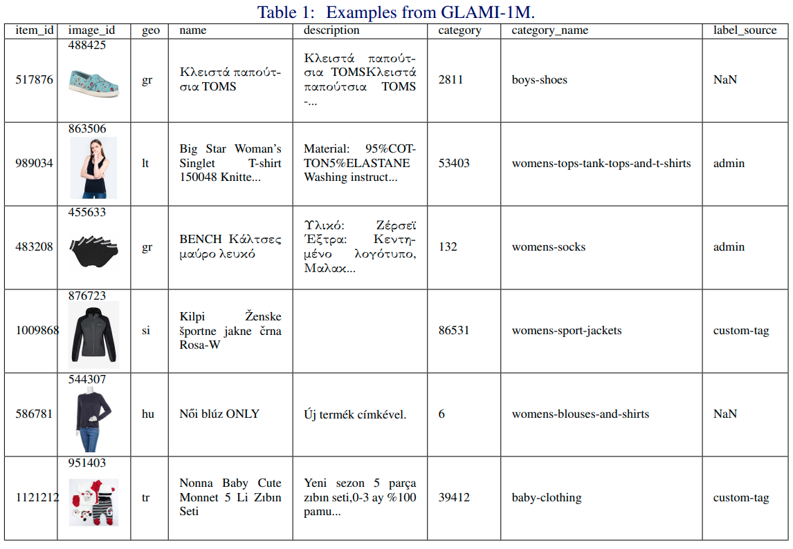

# GLAMI-1M: A Multilingual Image-Text Fashion Dataset

We introduce GLAMI-1M: the largest multilingual image-text classification dataset and benchmark. The dataset contains images of fashion products with item descriptions, each in 1 of 13 languages. Categorization into 191 classes has high-quality annotations: all 100k images in the test set and 75% of the 1M training set were human-labeled. The paper presents baselines for image-text classification showing that the dataset presents a challenging fine-grained classification problem: The best scoring EmbraceNet model using both visual and textual features achieves 69.7% accuracy. Experiments with a modified Imagen model show the dataset is also suitable for image generation conditioned on text.


## GLAMI-1M Paper

- The [paper](https://bmvc2022.mpi-inf.mpg.de/0607.pdf) (with [supplementary](https://docs.google.com/viewer?url=https://github.com/glami/glami-1m/raw/main/media/GLAMI-1M%20Supplementary.pdf)) was published at [BMVC 2022](https://bmvc2022.mpi-inf.mpg.de/607/).
- On [The Papers with Code, we set up multilingual image-text classification benchmark](https://paperswithcode.com/paper/glami-1m-a-multilingual-image-text-fashion-1).
- [Colab notebook](https://colab.research.google.com/drive/16gMqVqUpleacU5z9Y_7f3c-7I0C45esy?usp=sharing) within Google, and also in this repository. 

If you use or reference the dataset, please use the following BibTex entry to cite the paper:

```bibtex
@inproceedings{Kosar_2022_BMVC,
author    = {Vaclav Kosar and Antonín Hoskovec and Milan Šulc and Radek Bartyzal},
title     = {GLAMI-1M: A Multilingual Image-Text Fashion Dataset},
booktitle = {33rd British Machine Vision Conference 2022, {BMVC} 2022, London, UK, November 21-24, 2022},
publisher = {{BMVA} Press},
year      = {2022},
url       = {https://bmvc2022.mpi-inf.mpg.de/0607.pdf}
}
```


## How to Download GLAMI-1M Manually
You can either manually download the dataset zip file yourself or [use the repository scripts to download, extract, and load into a dataframe](#how-to-download-glami-1m-programmatically).

To manually download the dataset ZIP file(s):
- [GLAMI-1M Dataset (the default 228x298 version) here (1 zip  file of 11GB)](https://huggingface.co/datasets/glami/glami-1m/resolve/main/GLAMI-1M-dataset.zip).
  - You can use following commands to download this dataset file manually:
  ```
  wget -O GLAMI-1M-dataset.zip https://huggingface.co/datasets/glami/glami-1m/resolve/main/GLAMI-1M-dataset.zip
  ```
  - Calculate md5 hash with: 
  ```
  md5sum GLAMI-1M-dataset.zip
  ```
  - Then check that it returns:
  ```
  500348bbf54595db81cba353acd50d78  GLAMI-1M-dataset.zip
  ```
 
- [GLAMI-1M Dataset 800x800 version here (11 zip files of 54GB)](https://zenodo.org/record/7338792)
  (See Zenodo for md5 hashes)


## GLAMI-1M Code
Together with the dataset with provide helper code and experiments described in the paper.
The model weights will be uploaded soon.


### Installation

Below are steps to get minimal installation to be able to download the dataset with Python
```
conda create -n g1m python=3.9
conda activate g1m

git clone https://github.com/glami/glami-1m.git
cd glami-1m
pip install -r requirements_minimal.txt
```

### How to Download GLAMI-1M Programmatically

The 228x298 dataset version can be downloaded programmatically using repository Python code.
The destination directory to download and extract the dataset can be configured with environmental variable EXTRACT_DIR.
EXTRACT_DIR is by default configured as a Linux temporary directory, which is removed upon machine restarts.
Before downloading the dataset, make sure you have enough space to download and unzip corresponding version of the dataset.


```bash
EXTRACT_DIR="/tmp/GLAMI-1M/" python -c 'import load_dataset; load_dataset.download_dataset())'
```

After the download, we can load the dataset into a dataframe.

```bash
EXTRACT_DIR="/tmp/GLAMI-1M/" python -c 'import load_dataset; print(load_dataset.get_dataframe("test").head())'
```

### Baseline Weights

To fully produce all code in the repository install all requirements via:
```
pip install requirements.txt
```

The code is available in folders `classification`, `image-to-text`, and `translation`.
Weights for the baseline models described in the paper are available [here](https://zenodo.org/record/7353512).


# Examples


